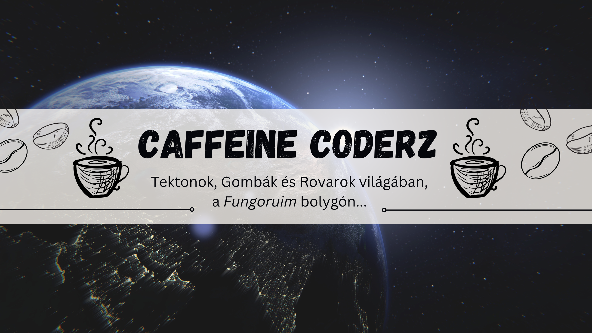

# Fungorium

Fungorium egy stratégiai szimulációs játék, amelyet az **Budapesti Műszaki és Gazdaságtudományi Egyetem (BME)** hallgatóiként fejlesztünk a **Projekt Laboratórium** kurzus keretében. A játék célja egy dinamikus ökoszisztéma modellezése, ahol a gombák és rovarok egymásra hatva formálják a bolygó felszínét.

## 🛸 A Fungorium világa
Fungorium egy távoli bolygó, amelyet gombák és rovarok népesítenek be. A bolygó felszínét **tektonok** alkotják, amelyek egy viszkózus rétegen "úsznak", és időnként kettétörhetnek, megváltoztatva a világ szerkezetét.

- **Gombák:** Gombafonalak és gombatestek formájában növekednek, terjednek és spóráikat szórva új területeket hódítanak meg.
- **Rovarok:** A gombafonalak mentén mozognak, spórákkal táplálkoznak és akár a fonalak elvágásával is befolyásolhatják a terjedést.
- **Tektonok:** Különböző hatással bírnak a gombák és rovarok viselkedésére; egyesek elősegítik a növekedést, míg mások akadályozzák azt.

## 🎮 A játék menete
A játékban kétféle szerepkörben lehet játszani:
- **Gombászok:** A gombák terjedését irányítják, meghatározzák a fonalak növekedését, a spóraszórást és a gombatestek fejlődését.
- **Rovarászok:** A rovarok mozgását irányítják, eldöntik, hogy egy adott fonalat elvágjanak-e, ezzel befolyásolva a többi játékos stratégiáját.

### 🎯 Győzelmi feltételek
- **A gombászok közül az nyer**, akinek a legtöbb (élő és halott) gombatestje fejlődött ki a játék végére.
- **A rovarászok közül az nyer**, aki a legtöbb tápanyagot gyűjtötte a spórák elfogyasztásával.

## 🛠️ Technológiai háttér
- **Nyelv:** Java
- **Fejlesztés:** GitHub szervezeti repóban dolgozunk, csapatmunkára optimalizálva
- **Felhasznált technológiák:**
  - Swing / JavaFX a GUI megvalósítására
  - Adatkezeléshez és szimulációhoz a Java gyűjteménykezelő rendszere
  - Fájlkezelés JSON/XML formátumban
  - JUnit tesztek a stabilitás érdekében

## 👥 Csapatunk
A projektet öt **BME-s hallgató** fejleszti közösen a **Projekt Laboratórium** tárgy keretében. Célunk egy izgalmas, stratégiai döntéseket igénylő szimulációs játék létrehozása, amely bemutatja a biológiai rendszerek és a játékmechanikák összefonódását.

